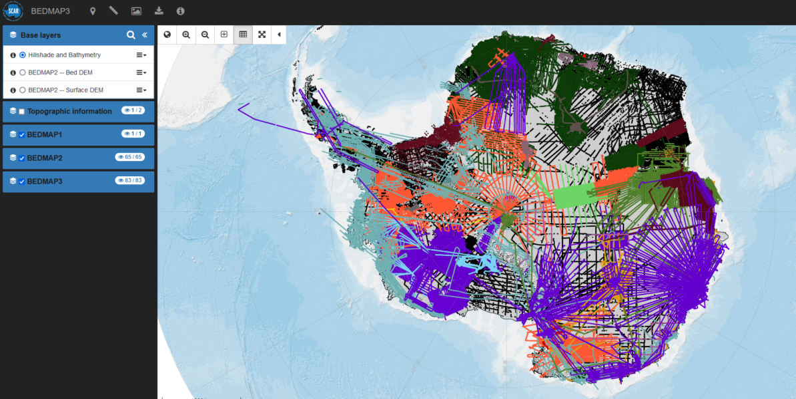

# About

[BEDMAP3](https://scar.org/science/bedmap3/about/) is a major collaborative project led by the Scientific Committee on Antarctic Research (SCAR) that aims to produce a new map and datasets of Antarctic ice thickness and bed topography for the international glaciology and geophysical community. 

We present in this book the different codes that have been used to create the shapefiles used in the BEDMAP3 data portal as well as ways to read, and calculate key parameters from the datasets.

:::{Note}
Have a look at the BEDMAP3 data portal [here](http://www.bedmap.scar.org) and the project page [here](https://www.bas.ac.uk/project/bedmap/)
:::

## References

More information about the project can be found in this data paper:
Alice C. Frémand, Peter Fretwell, Julien Bodart, Hamish D. Pritchard, Alan Aitken, Jonathan L. Bamber, Robin Bell, Cesido Bianchi, Robert G. Bingham, Donald D. Blankenship, Gino Casassa, Ginny Catania, Knut Christianson, Howard Conway, Hugh F. J. Corr, Xiangbin Cui, Detlef Damaske, Volkmar Damm, Reinhard Drews, Graeme Eagles, Olaf Eisen, Hannes Eisermann, Fausto Ferraccioli, Elena Field, René Forsberg, Steven Franke, Shuji Fujita, Yonggyu Gim, Vikram Goel, Siva Prasad Gogineni, Jamin Greenbaum, Benjamin Hills, Richard C. A. Hindmarsh, Andrew O. Hoffman, Per Holmlund, Nicholas Holschuh, John W. Holt, Annika N. Horlings, Angelika Humbert, Robert W. Jacobel, Daniela Jansen, Adrian Jenkins, Wilfried Jokat, Tom Jordan, Edward King, Jack Kohler, William Krabill, Mette Kusk Gillespie, Kirsty Langley, Joohan Lee, German Leitchenkov, Carlton Leuschen, Bruce Luyendyk, Joseph MacGregor, Emma MacKie, Kenichi Matsuoka, Mathieu Morlinghem, Jeremie Mouginot, Frank O. Nitsche, Yoshifumi Nogi, Ole A. Nost, John Paden, Frank Pattyn, Sergey V. Popov, Eric Rignot, David M. Rippin, Andres Rivera, Jason Roberts, Neil Ross, Antonia Ruppel, Dustin M. Schroeder, Martin J. Siegert, Andrew M. Smith, Daniel Steinhage, Michael Studinger, Bo Sun, Ignazio Tabacco, Kirsty Tinto, Stefano Urbini, David Vaughan, Brian C. Welch, Douglas S. Wilson, Duncan A. Young, and Achille Zirizzotti: Antarctic Bedmap data: FAIR sharing of 60 years of ice bed, surface and thickness data, Earth Syst. Sci. Data Discuss. https://doi.org/10.5194/essd-2022-355, 2023. 