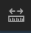
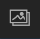

# User Guide

**Author**: Julien Bodart

This document is a short introduction to the different functionalities provided by the Polar Airborne Data Portal of BAS.  

The Layer List   menu in the top-left corner of the portal allows to toggle on/off the different surveys and accompanying layers stored on the portal. This menu is primarily divided into three core group layers: AeroGravity, AeroMagnetics, and AeroRadar. Within each of these groups are the individual surveys for which there is data.  

:::{Tip}
You can toggle the layers on/off manually one by one, or all at once by clicking on  or  the  button.  
:::

This menu also contains several basemaps (e.g. Bed elevation, Ice-flow velocity, Mean geothermal heat flux etc.) and important features (e.g. Antarctic coastlines, Ice drainage boundaries, Graticules, etc.) which can be toggled on/off to enhance the user experience. Note that, when available, the *Show Table*  widget provides a csv-like viewer to enable a closer view at the layers’ data and allows the user to select all or subsets of the data in the portal. 

 

Once you have selected the survey of your choice within the Aerogravity / Aeromagnetics / Aeroradar folders, you can make use of the zoom buttons in the top left corner of the portal and hover over individual survey lines where you will find a pop-up with more information on that specific segment, including a link to the DMS entry where you will be able to download the data. Selecting any AeroRadar layer in the Layer List menu will also allow you to view quicklook images of the radar data. 

:::{Tip}
To move from the ‘hover’ mode to a more static mode where the pop-up does not 	appear or disappear with every mouse move, click on a specific flightline segment 	(highlighted segments appear as bright 	blue). You can then choose to dock the pop-up 	window to the right hand side of the portal using the dock  button in the top-right of the 	window.  
:::

 

In the pop-up windows, you will find key information about the survey line selected, such as the name of the campaign and of the flightline, the year of the campaign, and links that will re-direct you to the DMS page where you will be able to download the data. Note that for the AeroRadar layers, the Radar_img attribute in the table also allows you to view the radar image for a particular segment in a larger window. You will also find key statistics about the particular segment such as mean ice thickness, surface elevation and bed elevation for AeroRadar layers; mean compensated (or low pass filtered) magnetic data for AeroMagnetics layers; and mean calculated absolute gravity for the AeroGravity layers along that particular segment. Segments are typically 25-km long, although some surveys are split in 50-km segments. 

 

You will also find additional widgets which might be of interest: 

 

**Top right**: You can use the *Search*  widget to search for a specific location over Antarctica, see the legend and units for the toggled-on layers using the Legend  widget, and share the map on social media or via a URL using the Share  widget. You will also be able to measure distances and draw polygons using the Measure  widget. 

:::{Tip}
The Search tool is tailored to the entire World per default, so it can get confused when 	you enter Antarctic-specific names. We suggest you follow the suggestions it provides if they 	are followed by ‘(ATA)’ – which stands for Antarctica. For example, for Pine Island Glacier, 	type ‘Pine Island’ and click on the suggestion from the Search tool showing ‘Pine Island 	Glacier, ATA’ rather than entering manually ‘Pine Island Glacier’ and hitting search.
:::

**Bottom left**: Clicking on the Overview map  widget allows you to see in real time where on the continent you are as you move the map cursor in the main window of the data portal. The background map for this widget is the default basemap for the portal (e.g. the Landsat Image Mosaic of Antarctica). 

 

Bottom right: The scale bar is shown with units in miles. You can use the Print  widget to print or save your map as a PDF, or alternatively you can take a screenshot of your area of interest and export it as a PNG using the Screenshot  widget. You will also find the ability to go full screen with the Full Screen  widget, although note that you will not be able to interact with the Show Table  widget in this mode. 

 
:::{Tip}
For a better image resolution, zoom in to the desired location prior to grabbing a 	screenshot. Also note that only the basemap and flightline will be on the screenshot – the 	legend and other pop-ups will not.  
:::

 

An [associated webpage](https://www.bas.ac.uk/polar-operations/sites-and-facilities/facility/airborne-science-and-technology/airborne-geophysics/) was created to provide more information about each of the surveys published on this data portal, and contains links to the DMS entries where the data is deposited. The full list of data available can be found [here](data_available) as well. You will also find in this book codes written for Python and MATLAB environments in order to read and plot the [radar](Checking_Airborne_Radar_Echo_sounding_data), [gravity](Checking_gravity_XYZ_data) and [magnetics](Checking_magnetics_XYZ_data) data.  

 

We hope you enjoy this new portal. To report any issue with the portal or the data hosted on it, please contact the Polar Data Centre at <PDCServiceDesk@bas.ac.uk>